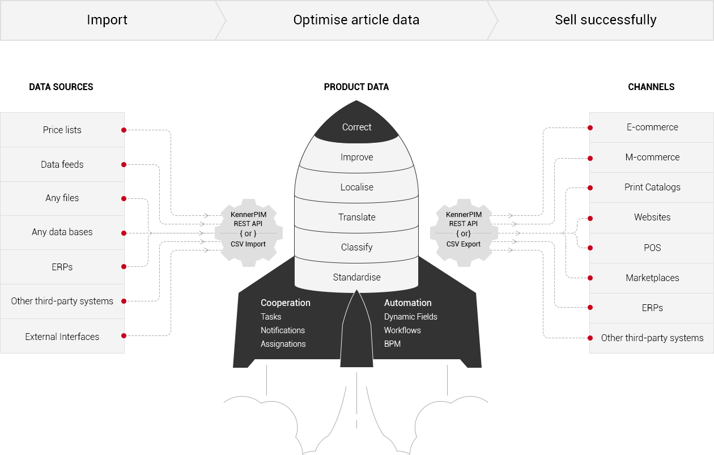

## What Is KennerPim?


KennerPim is an open-source product information management system (PIM), developed by [Kenner Soft Service GmbH](https://kennersoft.de), which is based on [KennerCore](https://github.com/kennersoft/kennercore) software platform and is developed by Kenner Soft Service GmbH. KennerPim (as well as KennerCore) is distributed under GPLv3 License and is free. It has a lot of features right out-of-the-box and thus is an excellent tool for cost-effective and timely application development.

KennerPim is a single page application (SPA) with an API-centric and service-oriented architecture (SOA). It has a flexible data model based on entities, entity attributes and relations of all kinds among them. KennerPim allows you to gather and store all your product content in one place, enrich it and spread it to several channels like own online shop, amazon, eBay, online shops of your distributors, on a tablet or mobile application. KennerPim will help you to structure and organize all your flexible data and get rid of excel mess. 

## What Are the Advantages of KennerPim?

- Many out-of-the-box features;
- Free – 100% open source, licensed under GPLv3;
- REST API;
- Service-oriented architecture (SOA);
- Responsive and user friendly UI;
- Configurable (entities, relations, layouts, labels, navigation, dashboards);
- Extensible with modules;
- Includes the advantages of [KennerCore](https://github.com/kennersoft/kennercore).

## How Does It Work?

KennerPim is an effective solution for storing, processing and managing your product information. All product data are extracted from different sources, classified, translated and enriched. KennerPim helps you publish the relevant data on different sales channels with minimum efforts. 



## Features

KennerPim comes with a lot of features directly out of the box, including:

- associations;
- measuring units;
- channels;
- catalogs;
- category trees and categories;
- product families;
- product series;
- products;
- attribute groups and attributes;
- portals;
- and much more.

Want to know more about KennerPim functions and its advantages for you? Please, visit [our website](https://kennerpim.com).
## Technology

KennerPim is based on KennerPim and uses PHP7, backbone.js, composer and some Zend Framework 3 libraries.


Want to know more about KennerPim technology? Please, visit [our website](https://kennerpim.com)!

## Integrations

KennerPim has a REST API and can be integrated with any third-party system, channel or marketplace. 

We offer following integrations:

- Data synchronisation with over 1000 Channels via channable.com
- ODOO
- SAP Business One,
- Microsoft Dynamics NAV
- Magento 2
- Magento 1
- Shopware 5
- OXID eShop 6
- and others.

Please, [ask](https://kennerpim.com/contact), if you want to know more.

## Documentation

- Documentation for users is available [here](docs/en/user-guide).
- Documentation for administrators is available [here](docs/en/administration/).
- Documentation for developers is available [here](docs/).

### Requirements

* Unix-based system.
* PHP 7.1 or above (with pdo_mysql, openssl, json, zip, gd, mbstring, xml, curl, exif, mailparse extensions).
* MySQL 5.5.3 or above.

### Configuration Instructions Based on Your Server

* [Apache server configuration](https://github.com/kennersoft/kennerpim/blob/master/docs/en/administration/apache-server-configuration.md)
* [Nginx server configuration](https://github.com/kennersoft/kennerpim/blob/master/docs/en/administration/nginx-server-configuration.md)

### Installation

> The Installation guide is based on **Linux Mint OS**. Of course, you can use any Unix-based system, but make sure that your OS supports the following commands.<br/>

To create your new KennerPim application, first make sure you are using PHP 7.1 or above and have [Composer](https://getcomposer.org/) installed.

1. Create your new project by running one of the following commands.

   If you don't need the demo data, run:
   ```
   composer create-project kennersoft/skeleton-pim my-kennerpim-project
   ```
   If you need the demo data, run:
    ```
   composer create-project kennersoft/skeleton-pim-demo my-kennerpim-project
   ```   

2. Change recursively the user and group ownership for project files: 
   ```
   chown -R webserver_user:webserver_user my-kennerpim-project/
   ```
   >**webserver_user** – depends on your webserver and can be one of the following: www, www-data, apache, etc.

3. Configure the crontab as described below.

   3.1. Run the following command:
      ```
      crontab -e -u webserver_user
      ```
   3.2. Add the following configuration:
      ```
      * * * * * /usr/bin/php /var/www/my-kennerpim-project/index.php cron
      ```      

4. Install KennerPim following the installation wizard in the web interface. Go to http://YOUR_PROJECT/
     
## License

KennerPim is published under the GNU GPLv3 [license](LICENSE.txt).
KennerPim based on TreoPIM. TreoPIM is an open-source product information management system (PIM), developed by TreoLabs GmbH, which is based on TreoCore software platform and is developed by TreoLabs GmbH.

## Support

- KennerPim is developed and supported by [Kenner Soft Service GmbH](https://kennersoft.de).
- To contact us, please visit [KennerPim Website](https://kennerpim.com).
